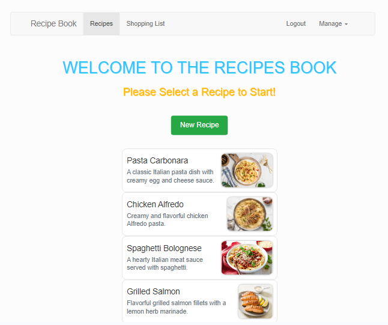

# Angular Recipe Book App :

# Get Started:

[Recipe Book App](https://recipes-angular-app.netlify.app) is a SPA that allows users to browse recipes and manage a shopping list. The project has a [Firebase](https://firebase.google.com/) backend which is used to allow users to create accounts and sign in with their credentials. Authenticated users can then edit recipes, plus save and fetch data from the Firebase endpoint.
To get started, you can use the admin user [admin@admin.com]() with password: **admin123**. Then be sure to Fetch Data from the Manage button at the top right corner of the page. This will load the user's recipes to be managed. From there you can build and manage an overall shopping list.

# Live Demo:

Link: https://recipes-angular-app.netlify.app

# Used libraries

- TypeScript
- Bootstrap5
- Angular
- authentication & route protection;
- HTTP request handling
- services & dependency injection
- routing
- observables
- forms (both template-driven and reactive)
- directives, components & databinding
- Firebase
- Recipe-website

